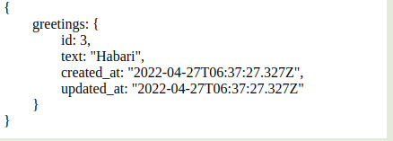

# Greetings data base

> This project is only supposed to be used as an api and used in a react app click the link below to see it in action.

## Built With
- rails 
- ruby


##  Link to where api is used
### [React App](https://github.com/Tchilo/hello-react-front-end)

## Usage

Use only to fetch one greeting at a time use the endpoint below


## Endpoint 
```
https://hola-rails-backend.herokuapp.com/v1/greetings
```

## Author

- GitHub: [Tchilo](https://github.com/Tchilo)


## 🤝 Contributing

Contributions, issues, and feature requests are welcome!

Feel free to check the [issues page](../../issues/).

## Show your support

Give a ⭐️ if you like this project!

## Acknowledgments

- Hat tip to anyone whose code was used
- Inspiration
- etc

## 📝 License

This project is [MIT](./MIT.md) licensed.
